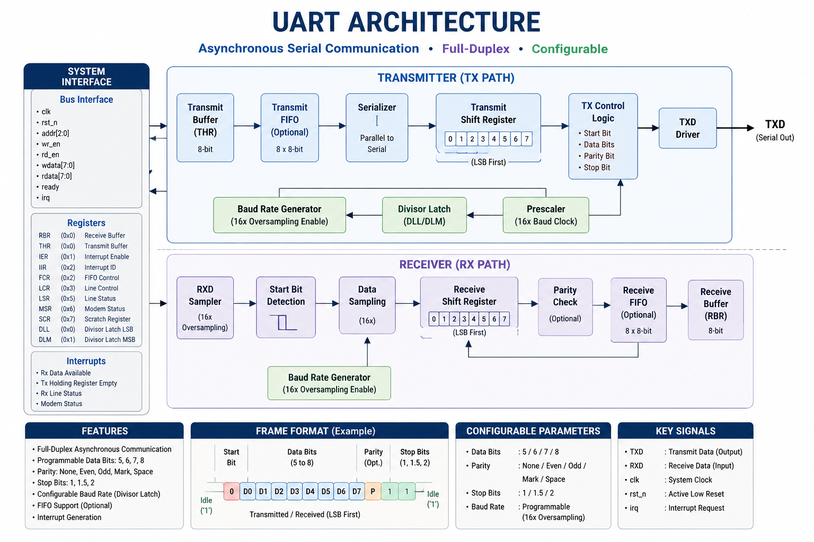
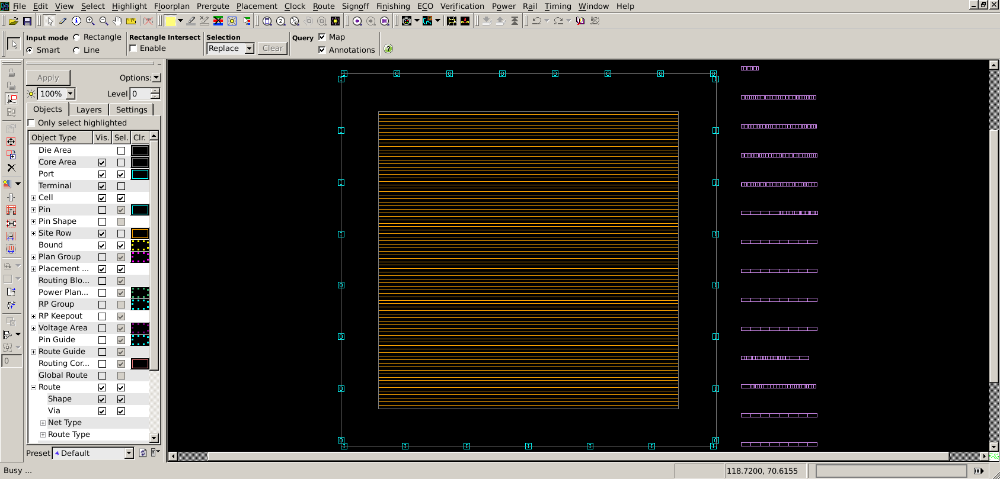
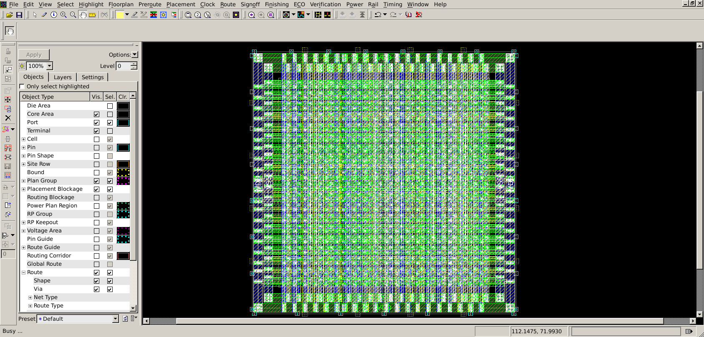
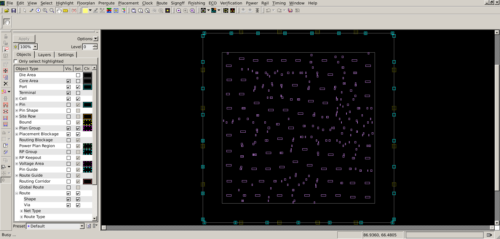
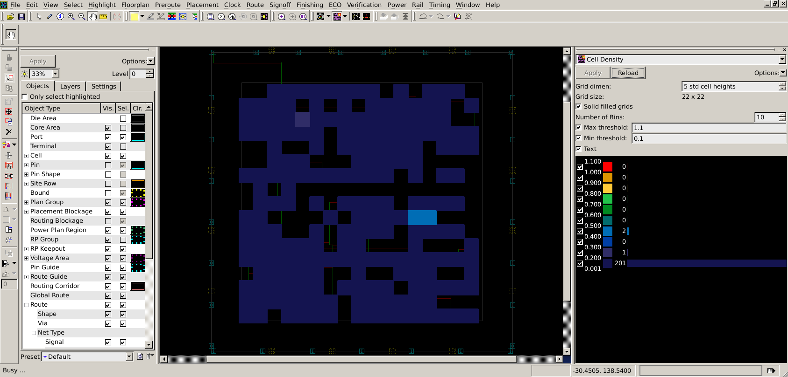
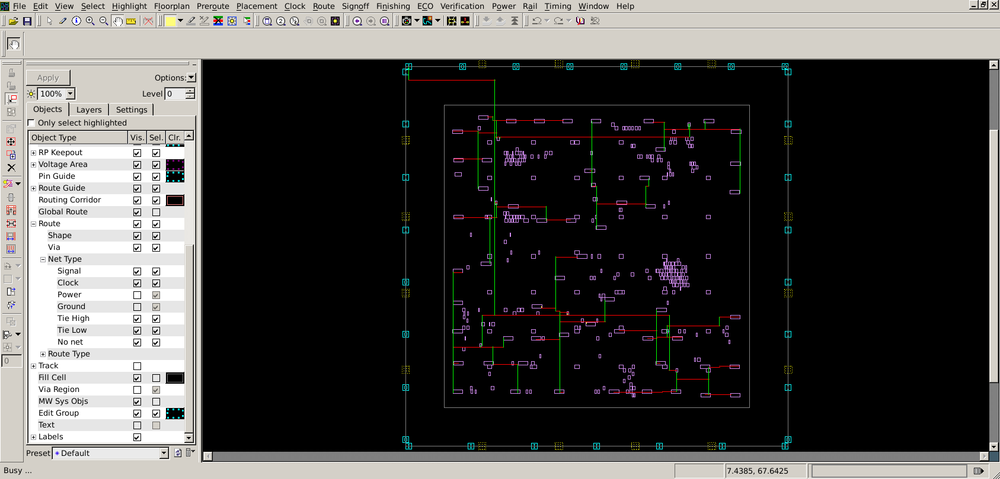
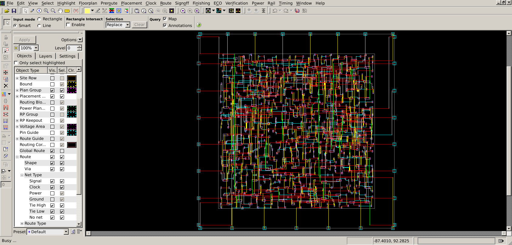

# Design and ASIC Implementation of UART


<p align="center">
  
</p>
A complete RTL-to-GDSII implementation of a configurable UART (Universal Asynchronous Receiver/Transmitter) using Verilog HDL and Synopsys IC Compiler, targeting the NangateOpenCellLibrary / FreePDK45 technology environment.

The project covers the complete digital ASIC implementation flow, starting from RTL design and functional verification through synthesis, floorplanning, power planning, placement, Clock Tree Synthesis (CTS), routing, timing analysis, IR-drop analysis, and final physical implementation.

---

## Overview

UART is a widely used asynchronous serial communication protocol that enables data transmission between digital systems without requiring a shared clock.

This project implements both:

- UART Transmitter (TX)
- UART Receiver (RX)

The design supports configurable parity modes and performs parallel-to-serial and serial-to-parallel data conversion.

The complete design was taken through the following ASIC implementation flow:

```text
RTL Design
    ↓
Functional Verification
    ↓
Logic Synthesis
    ↓
Floorplanning
    ↓
Power Planning
    ↓
Placement
    ↓
Clock Tree Synthesis (CTS)
    ↓
Routing
    ↓
Timing Analysis
    ↓
IR-Drop Analysis
    ↓
Physical Verification
    ↓
GDSII
```

---

## Table of Contents

- [Overview](#overview)
- [Features](#features)
- [Architecture](#architecture)
- [Project Structure](#project-structure)
- [Module Description](#module-description)
- [Verification](#verification)
- [ASIC Implementation Flow](#asic-implementation-flow)
  - [1. Synthesis](#1-synthesis)
  - [2. Floorplanning](#2-floorplanning)
  - [3. Power Planning](#3-power-planning)
  - [4. Placement](#4-placement)
  - [5. Clock Tree Synthesis (CTS)](#5-clock-tree-synthesis-cts)
  - [6. Routing](#6-routing)
  - [7. Timing Analysis](#7-timing-analysis)
  - [8. IR-Drop Analysis](#8-ir-drop-analysis)
  - [9. GDSII](#9-gdsii)
- [Physical Design Results](#physical-design-results)
- [Design Notes & Fixes](#design-notes--fixes)
- [How to Run](#how-to-run)
- [Tools and Technology](#tools-and-technology)
- [Roadmap](#roadmap)
- [Author](#author)

---

## Features

### Communication

- 8-bit UART
- Configurable Prescale
- LSB First transmission
- Independent TX/RX logic
- Start and stop bit generation
- Parallel-to-serial conversion
- Serial-to-parallel conversion

### Reliability

- Oversampling
- Majority Voting
- Configurable Parity
- Parity Error Detection
- Framing Error Detection
- Start-bit glitch detection

### RTL Design

- Modular RTL architecture
- Dedicated TX and RX blocks
- FSM-based control
- Shift-register-based serialization
- Parameterized data width and prescale

### ASIC Implementation

- Logic synthesis
- Floorplanning
- Power planning
- Standard-cell placement
- Clock Tree Synthesis
- Detailed routing
- Static timing analysis
- IR-drop analysis
- Physical implementation
- GDSII generation

---

## Architecture

<p align="center">
  
</p>

The UART consists of independent transmitter and receiver paths integrated through the top-level `UART_TOP` module.

### Transmit Path

```text
TX_FSM
   ↓
serializer
   ↓
parity_calc
   ↓
tx_mux
   ↓
TX_OUT
```

The transmitter controller manages the UART transmission sequence through:

```text
IDLE → START → DATA → PARITY → STOP
```

The serializer converts the parallel input data into a serial bit stream using a shift register.

The parity calculation block generates the selected parity bit when parity is enabled.

The multiplexer selects the appropriate UART frame bit for transmission.

### Receive Path

```text
RX_IN
  ↓
uart_rx_fsm
  ↓
data_sampling
  ↓
deserializer
  ↓
RX_P_DATA
```

The receiver uses oversampling and majority voting to improve sampling reliability.

Additional blocks are used for:

- Start-bit validation
- Parity checking
- Stop-bit / framing checking

Both TX and RX use the configurable `Prescale` value to control their internal bit timing.

---

## Project Structure

```text
Design-and-ASIC-Implementation-of-UART
│
├── RTL/
│   ├── UART_TX/
│   ├── UART_RX/
│   └── UART_TOP/
│
├── Verification/
│
├── docs/
│   ├── UART_TX/
│   │   └── README.md
│   │
│   ├── UART_RX/
│   │   └── README.md
│   │
│   └── UART_TOP/
│       └── README.md
│
├── images/
│   ├── UART_TX/
│   ├── UART_RX/
│   ├── UART_TOP/
│   │   ├── UART_ARCH.png
│   │   └── no_parity_test_case.PNG
│   │
│   └── ASIC/
│       ├── floorplan.png
│       ├── power_plan.png
│       ├── placement.png
│       ├── placement_congestion.png
│       ├── cts.png
│       ├── clock_tree.png
│       ├── routing.png
│       ├── routed_layout.png
│       ├── ir_drop.png
│       ├── ir_drop_map.png
│       └── final_layout.png
│
├── syn/
│   ├── netlist/
│   └── reports/
│
├── pnr/
│   ├── reports/
│   └── scripts/
│
├── gds/
│
└── README.md
```

---

## Module Description

| Module | Description | Documentation |
|---|---|---|
| 🚀 UART Transmitter | Parallel-to-serial UART transmitter | [`docs/UART_TX`](./docs/UART_TX/README.md) |
| 📥 UART Receiver | Serial-to-parallel UART receiver | [`docs/UART_RX`](./docs/UART_RX/README.md) |
| 🔗 UART TOP | Top-level TX/RX integration | [`docs/UART_TOP`](./docs/UART_TOP/README.md) |

---

## Verification

The UART transmitter, receiver, and integrated top-level design were verified using dedicated Verilog testbenches.

The verification covers both normal UART communication and error scenarios.

### Verification Summary

| Test Case | UART TX | UART RX | UART TOP |
|---|:---:|:---:|:---:|
| No Parity Frame | ✅ | ✅ | ✅ |
| Even Parity Frame | ✅ | ✅ | ✅ |
| Odd Parity Frame | ✅ | ✅ | ✅ |
| Parity Error Detection | — | ✅ | — |
| Framing Error Detection | — | ✅ | — |
| Parity + Framing Error | — | ✅ | — |
| End-to-End Communication | — | — | ✅ |

### UART Top-Level Verification

The following waveform demonstrates successful end-to-end UART communication.

<p align="center">
  
</p>

---

# ASIC Implementation Flow

The synthesized UART was implemented using Synopsys IC Compiler with the Nangate OpenCellLibrary /FreePDK45 technology environment.

```text
Synthesis
   ↓
Floorplanning
   ↓
Power Planning
   ↓
Placement
   ↓
CTS
   ↓
Routing
   ↓
Timing Analysis
   ↓
IR-Drop Analysis
   ↓
GDSII
```

---

# 1. Synthesis

The RTL design was synthesized into a gate-level netlist using the target standard-cell library.

### Objectives

- RTL-to-gate conversion
- Logic optimization
- Technology mapping
- Area optimization
- Timing optimization

### Results

| Metric | Result |
|---|---:|
| Cell Area | TBD |
| Number of Cells | TBD |
| Sequential Cells | TBD |
| Combinational Cells | TBD |
| WNS | TBD |
| TNS | TBD |

### Gate-Level Netlist

```text
syn/netlist/
```

---

# 2. Floorplanning

The synthesized design was imported into IC Compiler, and a physical floorplan was created.

The floorplanning stage includes:

- Die definition
- Core definition
- Standard-cell rows
- I/O pin placement
- Initial utilization configuration

### Floorplan

<p align="center">
  
</p>

### Floorplan Parameters

| Parameter | Value |
|---|---:|
| Die Width | TBD |
| Die Height | TBD |
| Core Width | TBD |
| Core Height | TBD |
| Aspect Ratio | TBD |
| Core Utilization | TBD |

---

# 3. Power Planning

A power distribution network was created to provide stable VDD and VSS connections throughout the design.

The power planning stage includes:

- VDD power ring
- VSS ground ring
- Power straps
- Standard-cell power connectivity
- Power-grid connectivity verification

### Power Planning

<p align="center">
  
</p>

### Power Network

```text
VDD → Power Ring → Power Straps → Standard Cells

VSS → Ground Ring → Ground Straps → Standard Cells
```

Power and ground connectivity were checked before performing rail analysis.

---

# 4. Placement

After floorplanning and power planning, the standard cells were placed inside the core area.

The placement stage aims to:

- Minimize wire length
- Reduce congestion
- Improve timing
- Maintain legal cell placement
- Prepare the design for CTS

### Placement Result

<p align="center">
  
</p>

### Placement Congestion

<p align="center">
  
</p>

### Placement Summary

| Metric | Result |
|---|---:|
| Utilization | TBD |
| Total Cell Count | TBD |
| Worst Congestion | TBD |
| WNS | TBD |
| TNS | TBD |

---

# 5. Clock Tree Synthesis (CTS)

Clock Tree Synthesis was performed to distribute the clock signal across the sequential elements.

The CTS stage includes:

- Clock buffer insertion
- Clock tree construction
- Clock skew optimization
- Clock latency optimization
- Transition optimization

### CTS Result

<p align="center">
  
</p>

### Clock Tree

<p align="center">
  
</p>

### CTS Summary

| Metric | Result |
|---|---:|
| Clock Latency | TBD |
| Clock Skew | TBD |
| Clock Transition | TBD |
| Number of Clock Buffers | TBD |
| WNS | TBD |
| TNS | TBD |

---

# 6. Routing

After CTS, the design was routed using the available metal layers.

Routing includes:

- Global routing
- Detailed routing
- Clock routing
- Signal routing
- Power connectivity

### Routed Design

<p align="center">
  
</p>

---

# 7. Timing Analysis

Static Timing Analysis was performed after CTS and routing to evaluate the timing performance of the final implementation.

The main timing metrics include:

- Setup timing
- Hold timing
- Worst Negative Slack (WNS)
- Total Negative Slack (TNS)
- Clock skew
- Critical path delay

### Timing Summary

| Metric | Result |
|---|---:|
| Setup WNS | TBD |
| Setup TNS | TBD |
| Hold WNS | TBD |
| Hold TNS | TBD |
| Clock Skew | TBD |
| Critical Path | TBD |

---

# 8. IR-Drop Analysis

IR-drop analysis was performed on the routed power distribution network to evaluate voltage drop caused by the resistance of the power network and current consumption of the standard cells.

The main power and ground rails analyzed were:

```text
VDD
VSS
```

### IR-Drop Analysis Flow

```text
Routed Design
     ↓
P/G Net Extraction
     ↓
Power & Current Analysis
     ↓
Rail Analysis
     ↓
Voltage Drop Calculation
     ↓
IR-Drop Map Generation
     ↓
Visualization in IC Compiler
```

### IR-Drop Map

<p align="center">
  
</p>

### IR-Drop Visualization

The IR-drop map provides a color-coded visualization of the voltage drop across the power grid.

A typical interpretation is:

```text
Blue / Green
     ↓
Low Voltage Drop

Yellow / Orange
     ↓
Moderate Voltage Drop

Red
     ↓
Highest Voltage Drop
```

The exact color range depends on the IC Compiler rail-analysis visualization settings.

### IR-Drop Results

| Parameter | Result |
|---|---:|
| Maximum IR Drop | TBD |
| Minimum Voltage | TBD |
| Average IR Drop | TBD |
| Worst Region | TBD |
| VDD Analysis | TBD |
| VSS Analysis | TBD |

### IR-Drop Analysis Data

The rail-analysis output is organized as:

```text
pr_UART_TOP_6_routed/
│
├── PR_LOG_DETAIL/
├── synopsys_rail_setup/
├── rail_map_data/
├── analyze_rail.log.*
├── analyze_rail.cmd.*
├── PrimeRail.cmd.*
├── UART_TOP_6_routed_VDD_integrity_err.txt
└── UART_TOP_6_routed_VSS_integrity_err.txt
```

The exported `rail_map_data` directory contains the data used to visualize the rail-analysis maps in IC Compiler.

---

# 9. GDSII

The final routed design is prepared for GDSII stream-out.

### GDSII Output

```text
gds/
└── uart.gds
```

### Final Layout

<p align="center">
  
</p>

The final layout represents the physical implementation after:

```text
Synthesis
   ↓
Floorplanning
   ↓
Power Planning
   ↓
Placement
   ↓
CTS
   ↓
Routing
   ↓
Timing Analysis
   ↓
IR-Drop Analysis
```

---

# Physical Design Results

| Stage | Status | Main Result |
|---|:---:|---|
| RTL Design | ✅ | Completed |
| Functional Verification | ✅ | Completed |
| Synthesis | ✅ | Completed |
| Floorplanning | ✅ | Completed |
| Power Planning | ✅ | Completed |
| Placement | ✅ | Completed |
| CTS | ✅ | Completed |
| Routing | ✅ | Completed |
| Timing Analysis | 🚧 | Results TBD |
| IR-Drop Analysis | 🚧 | Results TBD |
| GDSII | 🚧 | Results TBD |

---

# Design Notes & Fixes

## Shift Register Based Serialization

A shift-register based serializer was used for the transmitter to simplify serial data generation and reduce unnecessary logic.

## Configurable Parity

The UART supports:

```text
No Parity
Even Parity
Odd Parity
```

## Oversampling

The receiver uses oversampling to improve the reliability of data sampling.

## Majority Voting

Three samples are used for data validation through majority voting.

---

# How to Run

## RTL Simulation

The RTL can be simulated using the project's verification environment.

The main simulation flow is:

```text
Compile RTL
     ↓
Compile Testbench
     ↓
Run Simulation
     ↓
Analyze Waveforms
```

The UART top-level testbench verifies end-to-end TX/RX communication.

---

## ASIC Flow

The complete ASIC implementation follows:

```text
RTL
 ↓
Verification
 ↓
Synthesis
 ↓
Floorplan
 ↓
Power Plan
 ↓
Placement
 ↓
CTS
 ↓
Routing
 ↓
Timing Analysis
 ↓
IR-Drop Analysis
 ↓
GDSII
```

---

# Tools and Technology

| Tool / Technology | Purpose |
|---|---|
| Verilog HDL | RTL Design |
| Xilinx Vivado | Functional Simulation |
| Synopsys Design Compiler | Logic Synthesis |
| Synopsys IC Compiler | Physical Design |
| PrimeTime | Static Timing Analysis |
| PrimeRail | IR-Drop / Rail Analysis |
| NangateOpenCellLibrary | Standard Cell Library |
| FreePDK45 | Technology Environment |
| GDSII | Final Physical Layout Format |

---

# Roadmap

- [x] RTL Design
- [x] UART TX
- [x] UART RX
- [x] UART TOP Integration
- [x] Functional Verification
- [x] Logic Synthesis
- [x] Floorplanning
- [x] Power Planning
- [x] Placement
- [x] Clock Tree Synthesis
- [x] Routing
- [ ] Timing Signoff
- [ ] IR-Drop Signoff
- [ ] Final Physical Verification
- [ ] GDSII Finalization

---

# Author

**Mohamed Emad**

Faculty of Engineering, Zagazig University

Electronics and Communications Engineering

Digital ASIC Design & Verification Engineer

- GitHub: [MohamedEmad34](https://github.com/MohamedEmad34)
- LinkedIn: [Mohamed Emad](https://www.linkedin.com/in/mohamed-emad-578039241/)

---

# Project Highlights

This project demonstrates a complete digital ASIC implementation journey from RTL to physical design.

The main achievement is the integration of a configurable UART architecture with a complete ASIC implementation flow:

```text
RTL
 ↓
Verification
 ↓
Synthesis
 ↓
Floorplanning
 ↓
Power Planning
 ↓
Placement
 ↓
CTS
 ↓
Routing
 ↓
Timing Analysis
 ↓
IR-Drop Analysis
 ↓
GDSII
```

The project combines digital design, RTL verification, ASIC physical design, timing analysis, and power integrity analysis in one complete implementation.
