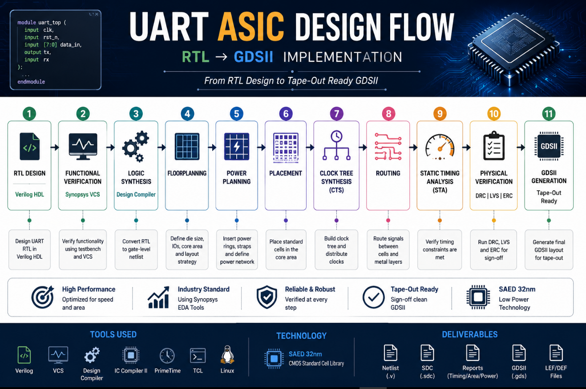
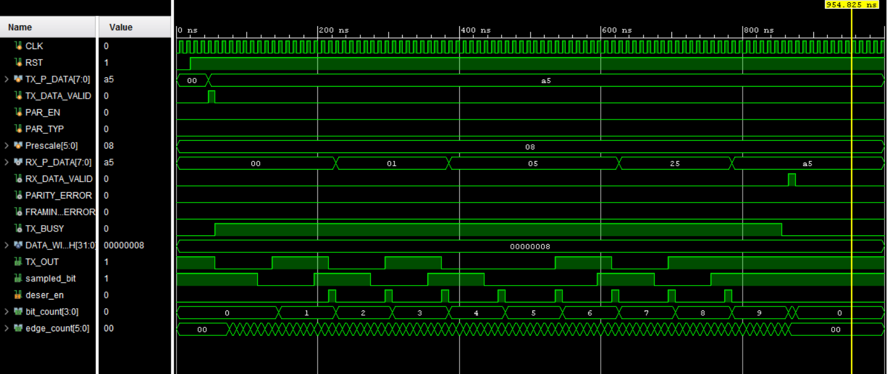
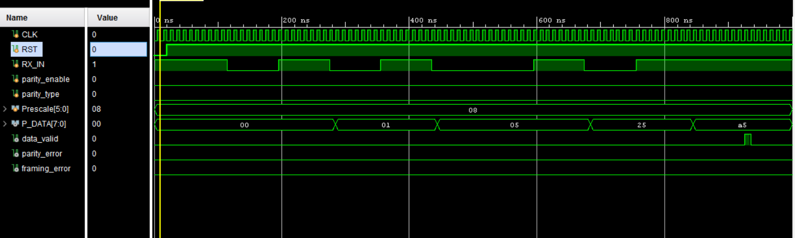

# Design and ASIC Implementation of UART


<p align="center">
  
</p>
---

## Overview

This repository presents the complete RTL design and verification of a Universal Asynchronous Receiver/Transmitter (UART) implemented in Verilog HDL. The project includes independently designed UART Transmitter (TX) and Receiver (RX) modules, integrated into a complete UART communication system, with the ASIC implementation currently in progress.

---

## Table of Contents

- [Features](#features)
- [Architecture](#architecture)
- [Project Structure](#project-structure)
- [Module Description](#module-description)
- [Verification](#verification)
- [How to Simulate](#how-to-simulate)
- [Design Notes & Fixes](#design-notes--fixes)
- [Roadmap](#roadmap)
- [Tools](#tools)
- [Author](#author)

---

## Features

Communication
-------------
✔ 8-bit UART
✔ Configurable Prescale
✔ LSB First

Reliability
-----------
✔ Oversampling
✔ Majority Voting
✔ Parity Check
✔ Framing Check

Design
------
✔ Modular RTL
✔ Independent TX/RX
✔ UART TOP

---

## Architecture


<p align="center">

</p>

**Transmit path:** `TX_FSM` (baud-tick driven) → `serializer` (parallel→serial shift register) → `parity_calc` → `mux` (selects start/data/parity/stop bit onto `TX_OUT`).

**Receive path:** `uart_rx_fsm` (baud-tick driven via `edge_bit_counter`) → `data_sampling` (3-sample majority vote) → `deserializer` (serial→parallel) → `start_check` / `parity_check` / `stop_check` (glitch, parity, and framing validation).

Both TX and RX divide the same system clock by `Prescale` internally, so a single shared value keeps transmitter and receiver bit timing aligned.

---

## Project Structure

```
Design-and-ASIC-Implementation-of-UART
│
├── RTL
│   ├── UART_TX
│   ├── UART_RX
│   └── UART_TOP
│
├── Verification
│   ├── UART_TX_tb
│   ├── UART_RX_tb
│   └── UART_TOP_tb
│
├── Images
│   ├── UART_TX
│   ├── UART_RX
│   └── UART_TOP
│
└── README.md
```

---

## Project Modules

| Module | Description |
|----------|-------------|
| **UART_TX** | Implements the UART transmitter responsible for converting 8-bit parallel data into serial frames. |
| **UART_RX** | Implements the UART receiver with oversampling, majority voting, parity checking, and framing error detection. |
| **UART_TOP** | Integrates the UART transmitter and receiver into a complete communication system for end-to-end verification. |

---
## Documentation

Detailed documentation for each module is available below:

- 📄 **UART Transmitter** → `docs/UART_TX/README.md`
- 📄 **UART Receiver** → `docs/UART_RX/README.md`
- 📄 **UART Top Integration** → `docs/UART_TOP/README.md`
## Verification

The design was verified with directed, self-checking testbenches covering:

| Test Case              | Status |
| ---------------------- | ------ |
| No Parity              | ✅      |
| Even Parity            | ✅      |
| Odd Parity             | ✅      |
| Parity Error           | ✅      |
| Framing Error          | ✅      |
| Parity + Framing Error | ✅      |
| TX/RX Integration      | ✅      |

---

## Verification Results

### UART Top

<p align="center">

</p>

### UART Receiver
<p align="center">

</p>

### UART Transmitter
<p align="center">

</p>

## Design Notes & Fixes

A few subtle timing bugs were found and fixed during bring-up, worth keeping in mind if you extend this design:

- **RX bit-count offset:** the same counter is used to time the start bit and the data bits, so the data-bit counter does not start at zero when `DATA` state begins. The exit condition for the `DATA` state accounts for this one-bit offset.
- **TX baud generation:** the transmit FSM needs its own `Prescale`-driven tick to pace state transitions and shifts; without it, the transmitter finishes a frame far faster than the receiver samples it.
- **Sticky error flags:** `PARITY_ERROR` and `FRAMING_ERROR` are cleared only at the start of a new frame, not on every cycle their enable is low — otherwise each flag is only valid for a single clock cycle and can be missed.

---

## Current Progress

| Phase            | Status |
| ---------------- | ------ |
| RTL Design       | ✅      |
| Verification     | ✅      |
| UART Integration | ✅      |
| ASIC Flow        | 🚧     |


---

## Physical Implementation

> This section will be filled in as each stage of the ASIC flow is completed. Placeholders below are ready for screenshots, reports, and metrics.

### Synthesis
- Status: ⏳ Not started
- Tool:
- Area report:
- Timing summary (setup/hold slack):
- Gate-level netlist: `syn/netlist.v` *(to be added)*

### Floorplanning
- Status: ⏳ Not started
- Die/core size:
- Aspect ratio / utilization:
- I/O pin placement:
- Floorplan screenshot: `docs/floorplan.png` *(to be added)*

### Power Planning
- Status: ⏳ Not started
- Power ring / stripe configuration:
- IR drop analysis:

### Placement
- Status: ⏳ Not started
- Placement density:
- Congestion map: `docs/placement.png` *(to be added)*

### Clock Tree Synthesis (CTS)
- Status: ⏳ Not started
- Clock skew:
- Clock latency:

### Routing & Timing Closure
- Status: ⏳ Not started
- DRC/LVS clean: 
- Final timing signoff (WNS/TNS):
- Routed layout screenshot: `docs/routing.png` *(to be added)*

### GDSII
- Status: ⏳ Not started
- Final GDS file: `gds/uart.gds` *(to be added)*
- Chip micrograph (if fabricated):

---

## Tools

| Tool | Purpose |
|---|---|
| Verilog HDL | RTL design |
| Xilinx Vivado | Functional simulation & waveform debug |

---

## Author

Mohamed Emad

Faculty of Engineering, Zagazig University

Electronics and Communications Engineering

Digital ASIC Design & Verification Engineer
