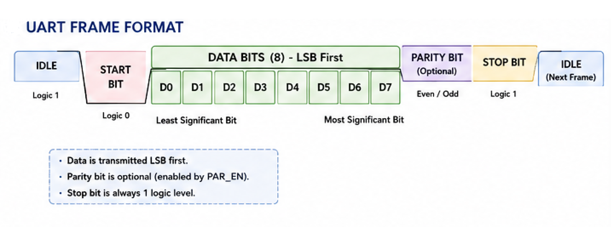
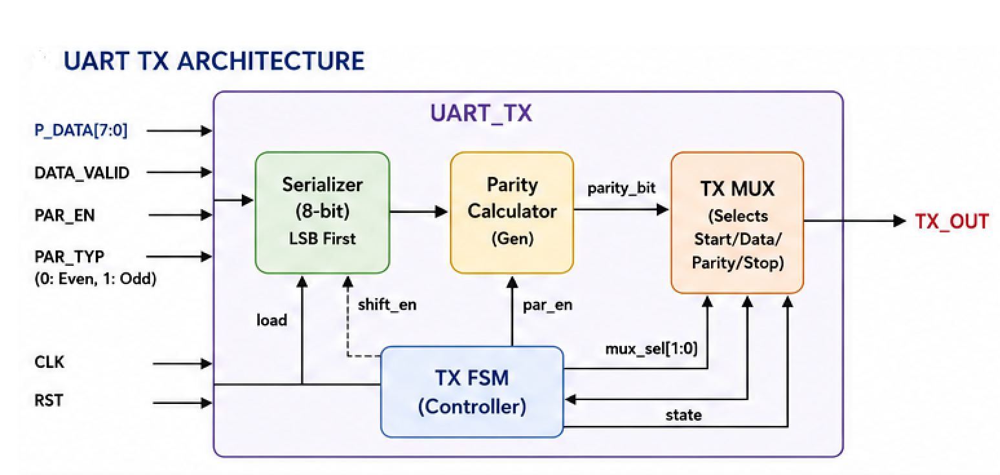
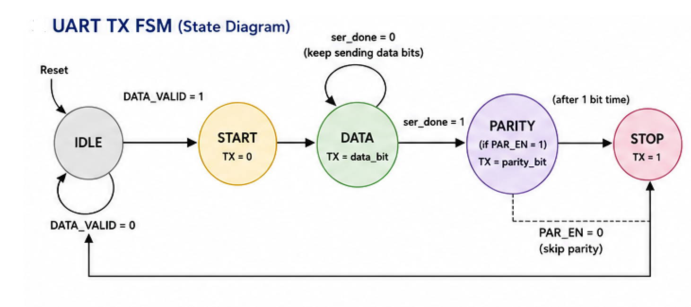
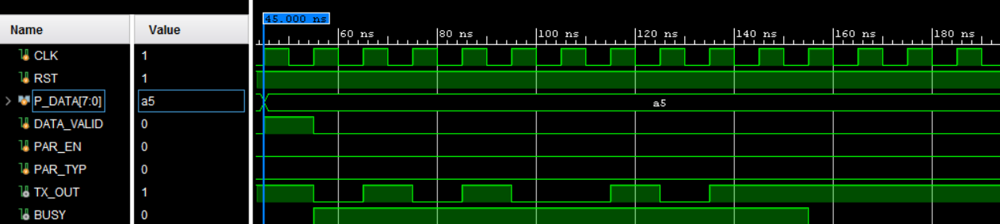
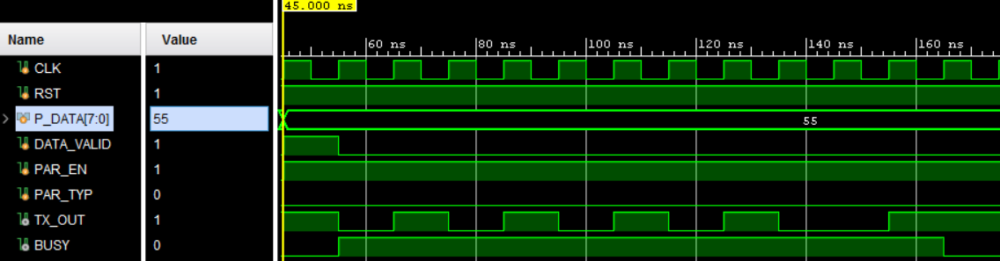
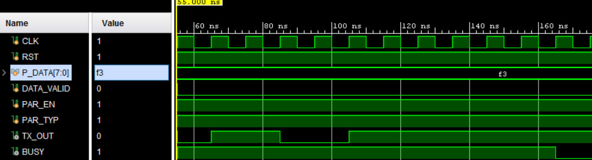

# UART Transmitter (UART TX)
  
 

A synthesizable UART (Universal Asynchronous Receiver/Transmitter) transmitter implemented in Verilog HDL. The design supports configurable parity generation and follows the standard UART frame format.

---

## Features

- 8-bit parallel data transmission
- LSB-first serialization
- Configurable parity
  - Even Parity
  - Odd Parity
  - No Parity
- Finite State Machine (FSM)-based controller
- Modular RTL Design
- Synthesizable Verilog HDL
- Self-contained Testbench

---

## UART Frame Format
The transmitter follows the standard UART frame format shown below.

<p align="center">

</p>


---

## UART TX Architecture

<p align="center">
</p>

---

## FSM

<p align="center">
</p>
</p>

| State  | Description                 |
| ------ | --------------------------- |
| IDLE   | Waits for DATA_VALID        |
| START  | Transmits the Start bit (0) |
| DATA   | Serializes 8-bit Data       |
| PARITY | Sends Parity Bit (Optional) |
| STOP   | Transmits the Stop bit (1)  |

---

## RTL Modules

| Module | Description |
|----------|-------------|
| UART_TX | Top-level UART transmitter |
| TX_FSM | Controls UART transmission sequence |
| serializer | Converts parallel data into serial data |
| parity_calc | Generates even/odd parity bit |
| tx_mux | Selects Start, Data, Parity or Stop bit |

---

## Simulation

The simulation verifies the correct UART frame generation, including Start Bit, Data Bits (LSB First), Optional Parity Bit, and Stop Bit.
| Test | Data    | Parity   | Status |
| ---- | ------- | -------- | ------ |
| TC1  | `8'hA5` | Disabled | ✅ Pass |
| TC2  | `8'h55` | Even     | ✅ Pass |
| TC3  | `8'hF3` | Odd      | ✅ Pass |


## Simulation Results

### Test Case 1 – Transmission without Parity

| Parameter | Value |
|-----------|-------|
| Data | 8'hA5 |
| Parity | Disabled |

<p align="center">

</p>

#### Verification Results

- The transmission starts with a **Start Bit (0)**.
- The 8-bit data (`8'hA5`) is transmitted **LSB first**.
- Since parity is disabled, no parity bit is transmitted.
- The frame ends with a **Stop Bit (1)**.
- The `BUSY` signal remains asserted during transmission and is deasserted after the frame is completed.
### Test Case 2 – Transmission with Even Parity

| Parameter | Value |
|-----------|-------|
| Data | `8'h55` |
| Parity | Even |

<p align="center">

</p>

#### Verification Results

- ✔ Start bit (`0`) is generated correctly.
- ✔ The data byte (`8'h55`) is transmitted **LSB first**.
- ✔ Data = `8'h55` (`01010101₂`) contains **four logic '1's**.
- ✔ The generated parity bit is `0`, preserving **even parity**.
- ✔ The frame is terminated with a valid **Stop bit (`1`)**.
- ✔ The `BUSY` signal remains asserted during transmission and is deasserted once the complete frame has been transmitted.

### Test Case 3 – Transmission with Odd Parity

| Parameter | Value |
|-----------|-------|
| Data | `8'hF3` |
| Parity | Odd |

<p align="center">

</p>

#### Verification Results

- ✔ Start bit (`0`) is generated correctly.
- ✔ The data byte (`8'hF3`) is transmitted **LSB first**.
- ✔ Data = `8'hF3` (`11110011₂`) contains **six logic '1's**.
- ✔ The generated parity bit is `1`, resulting in an **odd number of logic '1's** across the transmitted frame.
- ✔ The frame is terminated with a valid **Stop bit (`1`)**.
- ✔ The `BUSY` signal remains asserted during transmission and is deasserted once the complete frame has been transmitted.

  ---
  ## Simulation Summary

The UART transmitter was successfully verified under the following operating conditions:

- ✔ Transmission without parity.
- ✔ Transmission with even parity.
- ✔ Transmission with odd parity.
- ✔ Correct UART frame generation.
- ✔ Correct LSB-first serialization.
- ✔ Correct parity generation for both even and odd modes.
- ✔ Proper `BUSY` signal operation during frame transmission.
- ✔ Successful return to the IDLE state after the stop bit.
## Tools

- Verilog HDL
- Xilinx Vivado Simulator

---

## Folder Structure

```

UART_TX/
│
├── rtl/
│ ├── UART_TX.v
│ ├── TX_FSM.v
│ ├── serializer.v
│ ├── parity_calc.v
│ └── mux.v
│
├── tb/
│ └── UART_TX_tb.v
│
├── images/
│ ├── SERIALIZER.png
│ ├── TX_MUX.png
│ ├── UART_ARCH
│ ├── UART_FRAME_FORMAT
│ ├──UART_SYSTEM_ARCH
| ├── UART_SYSTEM_ARCHETICTURE
| ├──UART_TX_FSM
│
├── waveforms/
│ └── uart_tx_waveform.png
│
└── README.md

```

---

## Future Improvements

- Configurable Data Width
- Baud Rate Generator
- UART Receiver (RX)
- FIFO Buffer
- SystemVerilog Self-checking Testbench
- Functional Coverage
- ASIC synthesis using Synopsys Design Compiler
- Design-and-ASIC-Implementation-of-UART

---

## Author

Mohamed Emad

Faculty of Engineering
Zagazig University

Electronics and Communications Engineering

Digital IC Design | ASIC Physical Design | RTL Design
