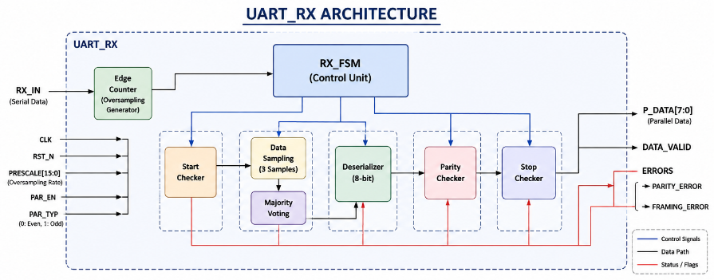
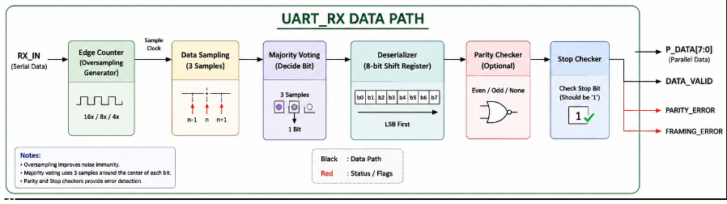
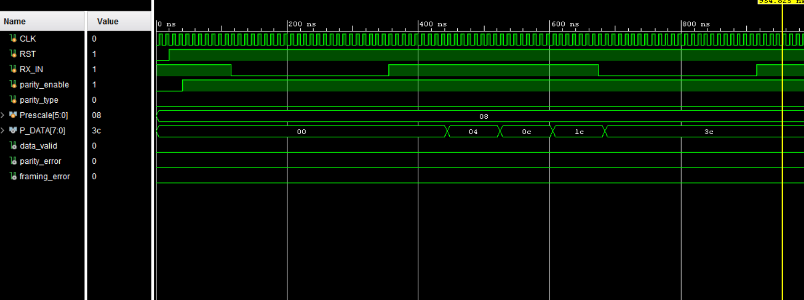
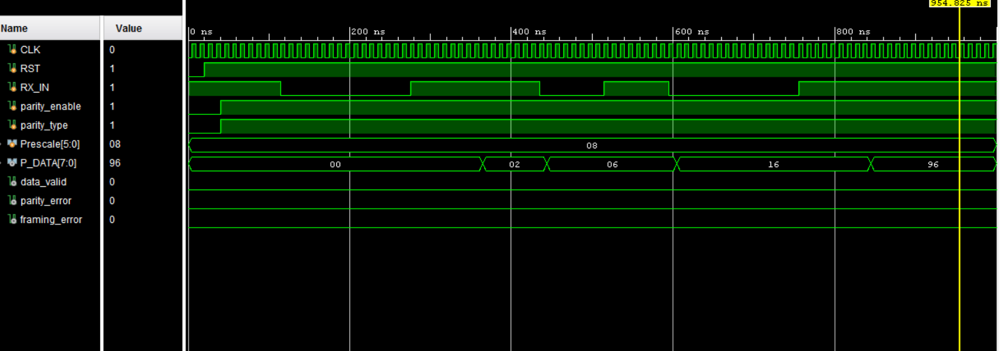
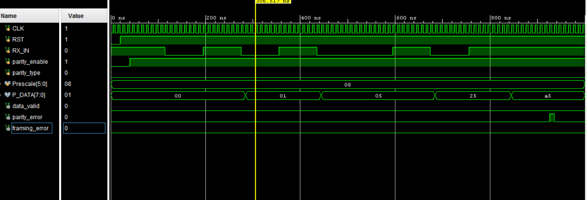
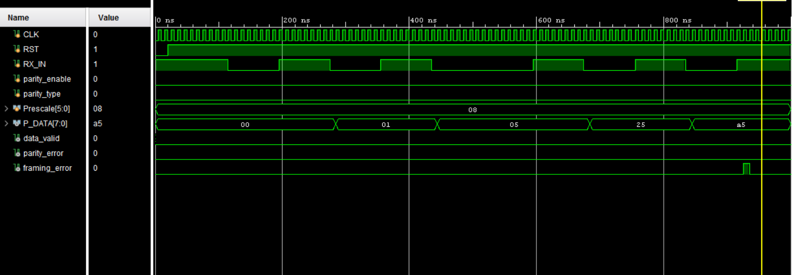

# UART Receiver (UART_RX)

The UART Receiver (UART_RX) reconstructs serial UART frames into 8-bit parallel data. It employs configurable oversampling and majority voting techniques to improve sampling accuracy while providing parity and framing error detection for reliable communication.

---

## Features

- 8-bit Serial-to-Parallel Reception
- Configurable Oversampling using Prescale
- Majority Voting Data Sampling
- Start Bit Detection
- Stop Bit Validation
- Configurable Parity Support
  - No Parity
  - Even Parity
  - Odd Parity
- Parity Error Detection
- Framing Error Detection
- Modular RTL Architecture
- Fully Synthesizable Verilog HDL

---

## UART_RX Architecture

<p align="center">
    
</p>

The receiver consists of several independent RTL modules coordinated by a finite state machine to ensure reliable UART reception.

| Module | Function |
|----------|----------|
| RX_FSM | Controls the reception process. |
| Edge Counter | Generates oversampling timing. |
| Data Sampling | Samples the incoming serial bit. |
| Majority Voting | Determines the final sampled value. |
| Start Checker | Validates the start bit. |
| Stop Checker | Validates the stop bit. |
| Deserializer | Converts serial data into parallel data. |
| Parity Checker | Detects parity errors. |

---

## RTL Hierarchy

```
UART_RX
│
├── RX_FSM
├── Edge Counter
├── Data Sampling
├── Majority Voting
├── Start Checker
├── Stop Checker
├── Deserializer
└── Parity Checker
```

---

## Receiver Operation

The UART receiver operates using configurable oversampling.

Each received bit is sampled multiple times according to the selected prescale value. Three samples around the center of each bit are collected, and the majority voting circuit determines the final logic value, improving noise immunity and communication reliability.

---
## Receiver Data Path

The following diagram illustrates the complete data flow inside the UART receiver, from the incoming serial bit stream to the recovered parallel data and error detection outputs.

<p align="center">
    
</p>
## Finite State Machine

The receiver is controlled by a finite state machine consisting of the following states:

| State | Description |
|--------|-------------|
| IDLE | Waits for the start bit. |
| START | Validates the received start bit. |
| DATA | Receives and deserializes the payload. |
| PARITY | Checks the received parity bit when enabled. |
| STOP | Validates the stop bit. |
| ERROR_CHK | Reports parity and framing errors and asserts Data Valid. |

<p align="center">
    
</p>

---

## Verification

The UART receiver was verified using a dedicated Verilog testbench covering normal operation and error scenarios.

The following verification cases passed successfully:

| Test Case | Status |
|------------|:------:|
| No Parity | ✅ |
| Even Parity | ✅ |
| Odd Parity | ✅ |
| Parity Error | ✅ |
| Framing Error | ✅ |
| Parity + Framing Error | ✅ |

---

## Simulation Results

### No Parity

<p align="center">
    
</p>

---

### Even Parity

<p align="center">
    
</p>

---

### Odd Parity

<p align="center">
    
</p>

---

### Parity Error Detection

<p align="center">
    
</p>

---

### Framing Error Detection

<p align="center">
    
</p>

---

## Conclusion

The UART Receiver successfully reconstructs serial UART frames into parallel data while providing robust error detection through configurable oversampling, majority voting, parity checking, and framing validation. Functional verification confirms correct operation under both normal and fault conditions, making the receiver ready for integration into the complete UART communication system and the subsequent RTL-to-GDSII ASIC implementation flow.
